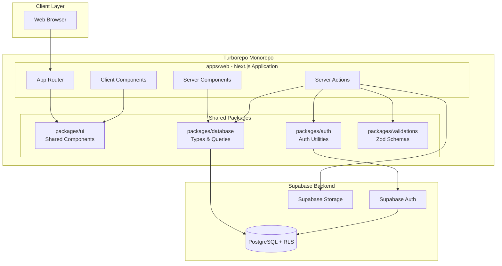
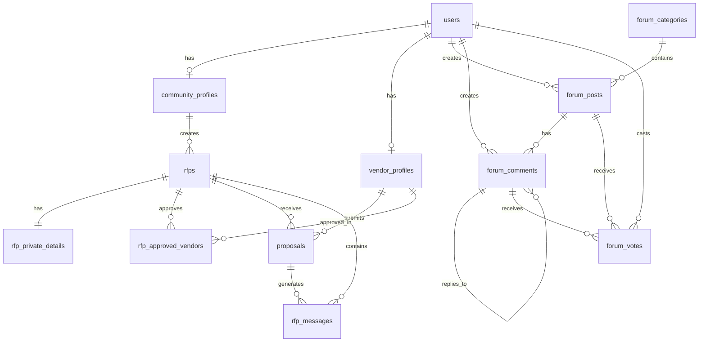
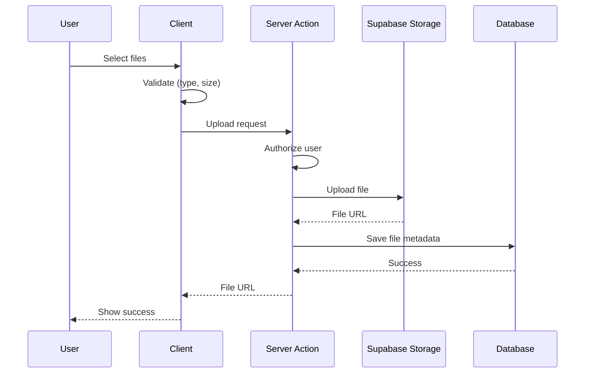

# Design Document

## Overview

Common Elements is a Next.js 14 web application that connects community association members with service vendors through a forum and RFP management system. The platform uses Supabase for backend services (PostgreSQL database, authentication, storage) and is deployed on Vercel.

### Architecture Goals

- **Speed to market**: Leverage integrated tools (Next.js + Supabase) for rapid development
- **Type safety**: End-to-end TypeScript with generated database types
- **Scalability**: Support 10,000+ users without architectural changes
- **Security**: Row Level Security (RLS) policies enforce all authorization rules
- **Performance**: Sub-3-second page loads with optimistic UI updates

### Technology Stack

**Monorepo Management:**
- Turborepo for monorepo orchestration
- Enables code sharing across future apps (admin, mobile)
- Fast, incremental builds
- Consistent tooling and configurations

**Frontend:**
- Next.js 14 (App Router with Server Components)
- TypeScript (strict mode)
- Tailwind CSS + Shadcn UI components
- React Query for server state management
- React Hook Form + Zod for form validation
- Tiptap for rich text editing

**Backend:**
- Supabase PostgreSQL database
- Supabase Auth for authentication
- Supabase Storage for file uploads
- Row Level Security (RLS) for authorization

**Deployment:**
- Vercel for hosting and CDN
- Automatic preview deployments for PRs
- Production deployment on merge to main


## Architecture

### System Architecture Diagram



### Monorepo Structure

The project uses Turborepo to organize code into apps and shared packages:

```
common-elements/
├── apps/
│   └── web/                    # Main Next.js application
│       ├── app/
│       │   ├── (auth)/         # Unauthenticated routes
│       │   │   ├── login/
│       │   │   └── signup/
│       │   ├── (platform)/     # Authenticated routes
│       │   │   ├── layout.tsx
│       │   │   ├── dashboard/
│       │   │   ├── forum/
│       │   │   │   ├── page.tsx
│       │   │   │   ├── new/
│       │   │   │   ├── [id]/
│       │   │   │   └── category/[slug]/
│       │   │   ├── rfps/
│       │   │   │   ├── page.tsx
│       │   │   │   ├── new/
│       │   │   │   ├── [id]/
│       │   │   │   └── [id]/proposals/
│       │   │   └── profile/
│       │   └── onboarding/
│       ├── components/         # App-specific components
│       ├── public/
│       └── package.json
│
├── packages/
│   ├── ui/                     # Shared UI components
│   │   ├── src/
│   │   │   ├── user-badge.tsx
│   │   │   ├── file-uploader.tsx
│   │   │   ├── rich-text-editor.tsx
│   │   │   ├── vote-buttons.tsx
│   │   │   └── index.ts
│   │   ├── package.json
│   │   └── tsconfig.json
│   │
│   ├── database/               # Database utilities
│   │   ├── src/
│   │   │   ├── types.ts        # Generated Supabase types
│   │   │   ├── client.ts       # Supabase client setup
│   │   │   ├── server.ts       # Server-side client
│   │   │   └── queries/        # Reusable query functions
│   │   │       ├── forum.ts
│   │   │       ├── rfps.ts
│   │   │       └── users.ts
│   │   └── package.json
│   │
│   ├── auth/                   # Auth utilities
│   │   ├── src/
│   │   │   ├── middleware.ts   # Auth middleware
│   │   │   ├── session.ts      # Session management
│   │   │   └── utils.ts        # Auth helpers
│   │   └── package.json
│   │
│   ├── validations/            # Zod schemas
│   │   ├── src/
│   │   │   ├── user.ts
│   │   │   ├── forum.ts
│   │   │   ├── rfp.ts
│   │   │   └── index.ts
│   │   └── package.json
│   │
│   ├── config-eslint/          # Shared ESLint config
│   ├── config-typescript/      # Shared TypeScript config
│   └── config-tailwind/        # Shared Tailwind config
│
├── turbo.json                  # Turborepo configuration
├── package.json                # Root package.json
└── README.md
```

### Future Expansion Paths

The monorepo structure enables easy addition of new applications:

```
apps/
├── web/              # Next.js web app (MVP) ✅
├── admin/            # Admin dashboard (Phase 2)
├── mobile/           # React Native app (Phase 3)
└── marketing/        # Landing/marketing site (Phase 2)
```

All apps share the same packages (ui, database, auth, validations), ensuring consistency and reducing duplication.

### Package Responsibilities

**packages/ui** - Shared UI Components
- UserBadge: Display user identity with avatar, role, location
- FileUploader: Drag-and-drop file upload with validation
- RichTextEditor: Tiptap-based rich text editor
- VoteButtons: Upvote/downvote with count display
- CommentSection: Threaded comments component
- All Shadcn UI components (Button, Card, Input, etc.)

**packages/database** - Database Layer
- Supabase client configuration (client-side and server-side)
- Generated TypeScript types from database schema
- Reusable query functions (getForumPosts, getRFPs, etc.)
- Database utility functions
- Type definitions for all database entities

**packages/auth** - Authentication & Authorization
- Auth middleware for route protection
- Session management utilities
- User context and hooks
- Authorization helper functions (canEditPost, canViewRFP, etc.)
- Token refresh logic

**packages/validations** - Data Validation
- Zod schemas for all forms (createPost, createRFP, etc.)
- Input validation rules
- Type inference from schemas
- Reusable validation utilities
- Error message definitions

**packages/config-*** - Shared Configurations
- ESLint rules consistent across all apps
- TypeScript compiler options
- Tailwind CSS configuration
- Prettier formatting rules

### Data Flow Patterns

**Server Components (Default):**
- Fetch data directly from Supabase
- Render on server for SEO and performance
- Used for: post listings, RFP listings, profile pages

**Client Components (When Needed):**
- Interactive forms with validation
- Real-time updates (comments, votes)
- File upload interfaces
- Used for: post creation, RFP forms, comment sections

**Server Actions:**
- Handle mutations (create, update, delete)
- Validate data with Zod schemas
- Enforce authorization before database operations
- Return type-safe results to client


## Components and Interfaces

### Component Architecture

Following atomic design principles with Shadcn UI as the foundation:

**Atoms (Shadcn Primitives):**
- Button, Input, Textarea, Select
- Badge, Avatar, Card
- Dialog, Dropdown, Tabs

**Molecules (Composed Components):**
- `UserBadge`: Avatar + name + role/company + location
- `VoteButtons`: Upvote/downvote with count display
- `FileUploader`: Drag-and-drop with preview
- `RichTextEditor`: Tiptap wrapper with toolbar

**Organisms (Feature Components):**
- `PostCard`: Complete post display with author, content, votes
- `CommentSection`: Threaded comments with reply functionality
- `RFPCard`: RFP summary with status and actions
- `ProposalCard`: Vendor proposal with key details
- `RFPForm`: Multi-step RFP creation form
- `ProposalForm`: Vendor proposal submission form

**Templates (Page Layouts):**
- `PlatformLayout`: Main navigation + content area
- `ForumLayout`: Category sidebar + post feed
- `RFPLayout`: Filters + RFP listings

### Key Component Interfaces


```typescript
// UserBadge - Used throughout the application
interface UserBadgeProps {
  user: {
    id: string
    name: string
    role?: string
    company?: string
    location?: string
    avatarUrl?: string
  }
  size?: 'sm' | 'md' | 'lg'
  showLocation?: boolean
  showBio?: boolean
  onClick?: () => void
}

// RichTextEditor - Forum posts and RFP descriptions
interface RichTextEditorProps {
  value: string
  onChange: (value: string) => void
  placeholder?: string
  maxLength?: number
  disabled?: boolean
}

// FileUploader - RFP and proposal attachments
interface FileUploaderProps {
  onUpload: (files: File[]) => Promise<void>
  maxFiles?: number
  maxSize?: number // in MB
  acceptedTypes?: string[]
  existingFiles?: Array<{
    name: string
    url: string
    size: number
  }>
  onRemove?: (fileUrl: string) => void
}

// CommentSection - Reusable for posts and RFPs
interface CommentSectionProps {
  parentId: string
  parentType: 'post' | 'rfp'
  comments: Comment[]
  currentUserId: string
  onSubmit: (content: string, parentId?: string) => Promise<void>
  onVote: (commentId: string, direction: 'up' | 'down') => Promise<void>
}
```


### Component Design Patterns

**Server Components by Default:**
```typescript
// app/(platform)/forum/page.tsx
export default async function ForumPage() {
  const supabase = createServerClient()
  const posts = await supabase
    .from('forum_posts')
    .select('*, author:users(*), category:forum_categories(*)')
    .order('created_at', { ascending: false })
    .limit(20)
  
  return <PostList posts={posts.data} />
}
```

**Client Components for Interactivity:**
```typescript
// components/forum/PostCard.tsx
'use client'

export function PostCard({ post }: { post: Post }) {
  const [voteCount, setVoteCount] = useState(post.vote_count)
  
  const handleVote = async (direction: 'up' | 'down') => {
    // Optimistic update
    setVoteCount(prev => prev + (direction === 'up' ? 1 : -1))
    
    // Server action
    await voteOnPost(post.id, direction)
  }
  
  return (
    <Card>
      <VoteButtons count={voteCount} onVote={handleVote} />
      {/* ... */}
    </Card>
  )
}
```

**Server Actions for Mutations:**
```typescript
// app/actions/forum.ts
'use server'

export async function createPost(data: CreatePostInput) {
  const supabase = createServerClient()
  const user = await getUser()
  
  // Validate with Zod
  const validated = createPostSchema.parse(data)
  
  // Insert with RLS enforcement
  const { data: post, error } = await supabase
    .from('forum_posts')
    .insert({
      ...validated,
      author_id: user.id
    })
    .select()
    .single()
  
  if (error) throw error
  
  revalidatePath('/forum')
  return post
}
```


## Data Models

### Database Schema

The database uses PostgreSQL with Supabase's built-in features (RLS, triggers, functions).

### Entity Relationship Diagram



### Core Tables


**users** (extends Supabase auth.users)
```sql
CREATE TABLE users (
  id UUID PRIMARY KEY REFERENCES auth.users(id),
  email TEXT UNIQUE NOT NULL,
  full_name TEXT NOT NULL,
  account_type TEXT NOT NULL CHECK (account_type IN ('community_member', 'vendor')),
  avatar_url TEXT,
  created_at TIMESTAMPTZ DEFAULT NOW(),
  updated_at TIMESTAMPTZ DEFAULT NOW()
);
```

**community_profiles**
```sql
CREATE TABLE community_profiles (
  id UUID PRIMARY KEY DEFAULT gen_random_uuid(),
  user_id UUID UNIQUE NOT NULL REFERENCES users(id) ON DELETE CASCADE,
  role TEXT NOT NULL CHECK (role IN (
    'board_president', 'board_member', 'property_manager', 
    'attorney', 'committee_member', 'resident'
  )),
  property_name TEXT NOT NULL,
  property_location TEXT NOT NULL,
  license_type TEXT,
  license_number TEXT,
  hide_property_name BOOLEAN DEFAULT FALSE,
  created_at TIMESTAMPTZ DEFAULT NOW(),
  updated_at TIMESTAMPTZ DEFAULT NOW()
);
```

**vendor_profiles**
```sql
CREATE TABLE vendor_profiles (
  id UUID PRIMARY KEY DEFAULT gen_random_uuid(),
  user_id UUID UNIQUE NOT NULL REFERENCES users(id) ON DELETE CASCADE,
  company_name TEXT NOT NULL,
  service_categories TEXT[] NOT NULL,
  service_areas TEXT[] NOT NULL,
  business_description TEXT,
  license_info TEXT,
  insurance_info TEXT,
  years_in_business INTEGER,
  created_at TIMESTAMPTZ DEFAULT NOW(),
  updated_at TIMESTAMPTZ DEFAULT NOW()
);
```


**forum_categories**
```sql
CREATE TABLE forum_categories (
  id UUID PRIMARY KEY DEFAULT gen_random_uuid(),
  slug TEXT UNIQUE NOT NULL,
  name TEXT NOT NULL,
  description TEXT,
  icon TEXT,
  sort_order INTEGER DEFAULT 0,
  created_at TIMESTAMPTZ DEFAULT NOW()
);
```

**forum_posts**
```sql
CREATE TABLE forum_posts (
  id UUID PRIMARY KEY DEFAULT gen_random_uuid(),
  author_id UUID NOT NULL REFERENCES users(id) ON DELETE CASCADE,
  category_id UUID NOT NULL REFERENCES forum_categories(id),
  title TEXT NOT NULL,
  content TEXT NOT NULL,
  vote_count INTEGER DEFAULT 0,
  comment_count INTEGER DEFAULT 0,
  view_count INTEGER DEFAULT 0,
  created_at TIMESTAMPTZ DEFAULT NOW(),
  updated_at TIMESTAMPTZ DEFAULT NOW()
);

CREATE INDEX idx_forum_posts_category ON forum_posts(category_id);
CREATE INDEX idx_forum_posts_author ON forum_posts(author_id);
CREATE INDEX idx_forum_posts_created ON forum_posts(created_at DESC);
```

**forum_comments**
```sql
CREATE TABLE forum_comments (
  id UUID PRIMARY KEY DEFAULT gen_random_uuid(),
  post_id UUID NOT NULL REFERENCES forum_posts(id) ON DELETE CASCADE,
  author_id UUID NOT NULL REFERENCES users(id) ON DELETE CASCADE,
  parent_comment_id UUID REFERENCES forum_comments(id) ON DELETE CASCADE,
  content TEXT NOT NULL,
  vote_count INTEGER DEFAULT 0,
  created_at TIMESTAMPTZ DEFAULT NOW(),
  updated_at TIMESTAMPTZ DEFAULT NOW()
);

CREATE INDEX idx_forum_comments_post ON forum_comments(post_id);
CREATE INDEX idx_forum_comments_parent ON forum_comments(parent_comment_id);
```

**forum_votes**
```sql
CREATE TABLE forum_votes (
  id UUID PRIMARY KEY DEFAULT gen_random_uuid(),
  user_id UUID NOT NULL REFERENCES users(id) ON DELETE CASCADE,
  votable_type TEXT NOT NULL CHECK (votable_type IN ('post', 'comment')),
  votable_id UUID NOT NULL,
  direction INTEGER NOT NULL CHECK (direction IN (-1, 1)),
  created_at TIMESTAMPTZ DEFAULT NOW(),
  UNIQUE(user_id, votable_type, votable_id)
);

CREATE INDEX idx_forum_votes_votable ON forum_votes(votable_type, votable_id);
```


**rfps**
```sql
CREATE TABLE rfps (
  id UUID PRIMARY KEY DEFAULT gen_random_uuid(),
  creator_id UUID NOT NULL REFERENCES community_profiles(id) ON DELETE CASCADE,
  title TEXT NOT NULL,
  category TEXT NOT NULL,
  description TEXT NOT NULL,
  visibility TEXT NOT NULL CHECK (visibility IN ('private', 'public')),
  status TEXT NOT NULL DEFAULT 'open' CHECK (status IN ('draft', 'open', 'reviewing', 'awarded', 'closed')),
  deadline TIMESTAMPTZ,
  budget_min DECIMAL,
  budget_max DECIMAL,
  proposal_count INTEGER DEFAULT 0,
  created_at TIMESTAMPTZ DEFAULT NOW(),
  updated_at TIMESTAMPTZ DEFAULT NOW()
);

CREATE INDEX idx_rfps_creator ON rfps(creator_id);
CREATE INDEX idx_rfps_status ON rfps(status);
CREATE INDEX idx_rfps_visibility ON rfps(visibility);
```

**rfp_private_details**
```sql
CREATE TABLE rfp_private_details (
  id UUID PRIMARY KEY DEFAULT gen_random_uuid(),
  rfp_id UUID UNIQUE NOT NULL REFERENCES rfps(id) ON DELETE CASCADE,
  property_address TEXT NOT NULL,
  contact_name TEXT NOT NULL,
  contact_email TEXT NOT NULL,
  contact_phone TEXT,
  detailed_scope TEXT NOT NULL,
  special_requirements TEXT,
  attachments JSONB DEFAULT '[]'::jsonb,
  created_at TIMESTAMPTZ DEFAULT NOW(),
  updated_at TIMESTAMPTZ DEFAULT NOW()
);
```

**rfp_approved_vendors**
```sql
CREATE TABLE rfp_approved_vendors (
  id UUID PRIMARY KEY DEFAULT gen_random_uuid(),
  rfp_id UUID NOT NULL REFERENCES rfps(id) ON DELETE CASCADE,
  vendor_id UUID NOT NULL REFERENCES vendor_profiles(id) ON DELETE CASCADE,
  status TEXT NOT NULL DEFAULT 'pending' CHECK (status IN ('pending', 'approved', 'rejected')),
  requested_at TIMESTAMPTZ DEFAULT NOW(),
  approved_at TIMESTAMPTZ,
  UNIQUE(rfp_id, vendor_id)
);

CREATE INDEX idx_rfp_approved_vendors_rfp ON rfp_approved_vendors(rfp_id);
CREATE INDEX idx_rfp_approved_vendors_vendor ON rfp_approved_vendors(vendor_id);
```


**proposals**
```sql
CREATE TABLE proposals (
  id UUID PRIMARY KEY DEFAULT gen_random_uuid(),
  rfp_id UUID NOT NULL REFERENCES rfps(id) ON DELETE CASCADE,
  vendor_id UUID NOT NULL REFERENCES vendor_profiles(id) ON DELETE CASCADE,
  cover_letter TEXT NOT NULL,
  timeline TEXT NOT NULL,
  cost DECIMAL NOT NULL,
  payment_terms TEXT NOT NULL,
  attachments JSONB DEFAULT '[]'::jsonb,
  status TEXT NOT NULL DEFAULT 'submitted' CHECK (status IN ('submitted', 'under_review', 'accepted', 'rejected')),
  created_at TIMESTAMPTZ DEFAULT NOW(),
  updated_at TIMESTAMPTZ DEFAULT NOW(),
  UNIQUE(rfp_id, vendor_id)
);

CREATE INDEX idx_proposals_rfp ON proposals(rfp_id);
CREATE INDEX idx_proposals_vendor ON proposals(vendor_id);
```

**rfp_messages**
```sql
CREATE TABLE rfp_messages (
  id UUID PRIMARY KEY DEFAULT gen_random_uuid(),
  rfp_id UUID NOT NULL REFERENCES rfps(id) ON DELETE CASCADE,
  sender_id UUID NOT NULL REFERENCES users(id) ON DELETE CASCADE,
  recipient_id UUID NOT NULL REFERENCES users(id) ON DELETE CASCADE,
  content TEXT NOT NULL,
  read_at TIMESTAMPTZ,
  created_at TIMESTAMPTZ DEFAULT NOW()
);

CREATE INDEX idx_rfp_messages_rfp ON rfp_messages(rfp_id);
CREATE INDEX idx_rfp_messages_recipient ON rfp_messages(recipient_id, read_at);
```

### Database Triggers and Functions

**Update vote counts automatically:**
```sql
CREATE OR REPLACE FUNCTION update_vote_count()
RETURNS TRIGGER AS $$
BEGIN
  IF TG_OP = 'INSERT' THEN
    IF NEW.votable_type = 'post' THEN
      UPDATE forum_posts SET vote_count = vote_count + NEW.direction WHERE id = NEW.votable_id;
    ELSIF NEW.votable_type = 'comment' THEN
      UPDATE forum_comments SET vote_count = vote_count + NEW.direction WHERE id = NEW.votable_id;
    END IF;
  ELSIF TG_OP = 'DELETE' THEN
    IF OLD.votable_type = 'post' THEN
      UPDATE forum_posts SET vote_count = vote_count - OLD.direction WHERE id = OLD.votable_id;
    ELSIF OLD.votable_type = 'comment' THEN
      UPDATE forum_comments SET vote_count = vote_count - OLD.direction WHERE id = OLD.votable_id;
    END IF;
  END IF;
  RETURN NULL;
END;
$$ LANGUAGE plpgsql;

CREATE TRIGGER forum_votes_update_count
AFTER INSERT OR DELETE ON forum_votes
FOR EACH ROW EXECUTE FUNCTION update_vote_count();
```


**Update comment counts:**
```sql
CREATE OR REPLACE FUNCTION update_comment_count()
RETURNS TRIGGER AS $$
BEGIN
  IF TG_OP = 'INSERT' THEN
    UPDATE forum_posts SET comment_count = comment_count + 1 WHERE id = NEW.post_id;
  ELSIF TG_OP = 'DELETE' THEN
    UPDATE forum_posts SET comment_count = comment_count - 1 WHERE id = OLD.post_id;
  END IF;
  RETURN NULL;
END;
$$ LANGUAGE plpgsql;

CREATE TRIGGER forum_comments_update_count
AFTER INSERT OR DELETE ON forum_comments
FOR EACH ROW EXECUTE FUNCTION update_comment_count();
```

**Update proposal counts:**
```sql
CREATE OR REPLACE FUNCTION update_proposal_count()
RETURNS TRIGGER AS $$
BEGIN
  IF TG_OP = 'INSERT' THEN
    UPDATE rfps SET proposal_count = proposal_count + 1 WHERE id = NEW.rfp_id;
  ELSIF TG_OP = 'DELETE' THEN
    UPDATE rfps SET proposal_count = proposal_count - 1 WHERE id = OLD.rfp_id;
  END IF;
  RETURN NULL;
END;
$$ LANGUAGE plpgsql;

CREATE TRIGGER proposals_update_count
AFTER INSERT OR DELETE ON proposals
FOR EACH ROW EXECUTE FUNCTION update_proposal_count();
```

**Update timestamps:**
```sql
CREATE OR REPLACE FUNCTION update_updated_at()
RETURNS TRIGGER AS $$
BEGIN
  NEW.updated_at = NOW();
  RETURN NEW;
END;
$$ LANGUAGE plpgsql;

-- Apply to all tables with updated_at
CREATE TRIGGER update_users_updated_at BEFORE UPDATE ON users
FOR EACH ROW EXECUTE FUNCTION update_updated_at();

CREATE TRIGGER update_community_profiles_updated_at BEFORE UPDATE ON community_profiles
FOR EACH ROW EXECUTE FUNCTION update_updated_at();

-- ... (apply to all relevant tables)
```


## Authorization and Security

### Row Level Security (RLS) Policies

All tables have RLS enabled. Policies enforce authorization at the database level.

**users table:**
```sql
-- Anyone can read public user info
CREATE POLICY "Users are viewable by everyone"
ON users FOR SELECT
USING (true);

-- Users can update their own record
CREATE POLICY "Users can update own record"
ON users FOR UPDATE
USING (auth.uid() = id);
```

**community_profiles table:**
```sql
-- Anyone can read profiles (respecting privacy settings)
CREATE POLICY "Profiles are viewable by everyone"
ON community_profiles FOR SELECT
USING (true);

-- Users can update their own profile
CREATE POLICY "Users can update own profile"
ON community_profiles FOR UPDATE
USING (auth.uid() = user_id);

-- Users can insert their own profile
CREATE POLICY "Users can insert own profile"
ON community_profiles FOR INSERT
WITH CHECK (auth.uid() = user_id);
```

**forum_posts table:**
```sql
-- Anyone can read posts
CREATE POLICY "Posts are viewable by everyone"
ON forum_posts FOR SELECT
USING (true);

-- Authenticated users can create posts
CREATE POLICY "Authenticated users can create posts"
ON forum_posts FOR INSERT
WITH CHECK (auth.uid() = author_id);

-- Authors can update their own posts
CREATE POLICY "Authors can update own posts"
ON forum_posts FOR UPDATE
USING (auth.uid() = author_id);

-- Authors can delete their own posts
CREATE POLICY "Authors can delete own posts"
ON forum_posts FOR DELETE
USING (auth.uid() = author_id);
```


**forum_votes table:**
```sql
-- Users can read all votes
CREATE POLICY "Votes are viewable by everyone"
ON forum_votes FOR SELECT
USING (true);

-- Users can insert their own votes
CREATE POLICY "Users can insert own votes"
ON forum_votes FOR INSERT
WITH CHECK (auth.uid() = user_id);

-- Users can delete their own votes
CREATE POLICY "Users can delete own votes"
ON forum_votes FOR DELETE
USING (auth.uid() = user_id);
```

**rfps table:**
```sql
-- Anyone can read basic RFP info
CREATE POLICY "RFPs are viewable by everyone"
ON rfps FOR SELECT
USING (true);

-- Only community members can create RFPs
CREATE POLICY "Community members can create RFPs"
ON rfps FOR INSERT
WITH CHECK (
  EXISTS (
    SELECT 1 FROM community_profiles
    WHERE user_id = auth.uid() AND id = creator_id
  )
);

-- Creators can update their own RFPs
CREATE POLICY "Creators can update own RFPs"
ON rfps FOR UPDATE
USING (
  EXISTS (
    SELECT 1 FROM community_profiles
    WHERE user_id = auth.uid() AND id = creator_id
  )
);
```

**rfp_private_details table:**
```sql
-- Only creator and approved vendors can read private details
CREATE POLICY "Private details viewable by creator and approved vendors"
ON rfp_private_details FOR SELECT
USING (
  -- Creator can see
  EXISTS (
    SELECT 1 FROM rfps r
    JOIN community_profiles cp ON r.creator_id = cp.id
    WHERE r.id = rfp_id AND cp.user_id = auth.uid()
  )
  OR
  -- Approved vendor can see
  EXISTS (
    SELECT 1 FROM rfp_approved_vendors rav
    JOIN vendor_profiles vp ON rav.vendor_id = vp.id
    WHERE rav.rfp_id = rfp_id 
      AND rav.status = 'approved'
      AND vp.user_id = auth.uid()
  )
  OR
  -- Public RFPs are visible to all
  EXISTS (
    SELECT 1 FROM rfps
    WHERE id = rfp_id AND visibility = 'public'
  )
);

-- Only creator can insert/update private details
CREATE POLICY "Creators can manage private details"
ON rfp_private_details FOR ALL
USING (
  EXISTS (
    SELECT 1 FROM rfps r
    JOIN community_profiles cp ON r.creator_id = cp.id
    WHERE r.id = rfp_id AND cp.user_id = auth.uid()
  )
);
```


**proposals table:**
```sql
-- Creator can see all proposals for their RFPs
-- Vendors can see only their own proposals
CREATE POLICY "Proposals viewable by creator and vendor"
ON proposals FOR SELECT
USING (
  -- RFP creator can see all proposals
  EXISTS (
    SELECT 1 FROM rfps r
    JOIN community_profiles cp ON r.creator_id = cp.id
    WHERE r.id = rfp_id AND cp.user_id = auth.uid()
  )
  OR
  -- Vendor can see their own proposal
  EXISTS (
    SELECT 1 FROM vendor_profiles vp
    WHERE vp.id = vendor_id AND vp.user_id = auth.uid()
  )
);

-- Only vendors can create proposals
CREATE POLICY "Vendors can create proposals"
ON proposals FOR INSERT
WITH CHECK (
  EXISTS (
    SELECT 1 FROM vendor_profiles
    WHERE id = vendor_id AND user_id = auth.uid()
  )
);

-- Vendors can update their own proposals
CREATE POLICY "Vendors can update own proposals"
ON proposals FOR UPDATE
USING (
  EXISTS (
    SELECT 1 FROM vendor_profiles
    WHERE id = vendor_id AND user_id = auth.uid()
  )
);
```

**rfp_messages table:**
```sql
-- Users can read messages where they are sender or recipient
CREATE POLICY "Users can read own messages"
ON rfp_messages FOR SELECT
USING (
  auth.uid() = sender_id OR auth.uid() = recipient_id
);

-- Users can send messages
CREATE POLICY "Users can send messages"
ON rfp_messages FOR INSERT
WITH CHECK (auth.uid() = sender_id);
```

### Authentication Flow

**Signup Process:**
1. User submits email/password to Supabase Auth
2. Supabase creates auth.users record
3. Trigger creates corresponding users table record
4. User redirected to onboarding
5. User completes profile (community_profiles or vendor_profiles)
6. Session established with 7-day expiry

**Session Management:**
- Sessions stored in httpOnly cookies
- Middleware checks authentication on all protected routes
- Refresh tokens rotated automatically
- Logout clears cookies and database session


## Error Handling

### Error Handling Strategy

**Client-Side Errors:**
- Form validation errors displayed inline with field
- Network errors shown in toast notifications
- Optimistic updates rolled back on failure
- Retry mechanisms for transient failures

**Server-Side Errors:**
- Zod validation errors return structured error messages
- Database errors logged and return generic user message
- Authorization errors return 403 with clear message
- Not found errors return 404 with helpful context

### Error Types and Responses

```typescript
// Validation errors
type ValidationError = {
  type: 'validation'
  field: string
  message: string
}

// Authorization errors
type AuthorizationError = {
  type: 'authorization'
  message: string
  requiredRole?: string
}

// Database errors
type DatabaseError = {
  type: 'database'
  message: string
  code?: string
}

// Generic error response
type ErrorResponse = {
  success: false
  error: ValidationError | AuthorizationError | DatabaseError
}
```

### Error Handling Examples

**Form Validation:**
```typescript
'use server'

export async function createPost(formData: FormData) {
  try {
    const data = createPostSchema.parse({
      title: formData.get('title'),
      content: formData.get('content'),
      category_id: formData.get('category_id')
    })
    
    // ... create post
    
    return { success: true, data: post }
  } catch (error) {
    if (error instanceof z.ZodError) {
      return {
        success: false,
        error: {
          type: 'validation',
          issues: error.issues
        }
      }
    }
    
    return {
      success: false,
      error: {
        type: 'unknown',
        message: 'Failed to create post'
      }
    }
  }
}
```


**Authorization Checks:**
```typescript
'use server'

export async function createRFP(data: CreateRFPInput) {
  const supabase = createServerClient()
  const user = await getUser()
  
  // Check if user is a community member
  const { data: profile } = await supabase
    .from('community_profiles')
    .select('id')
    .eq('user_id', user.id)
    .single()
  
  if (!profile) {
    return {
      success: false,
      error: {
        type: 'authorization',
        message: 'Only community members can create RFPs',
        requiredRole: 'community_member'
      }
    }
  }
  
  // ... create RFP
}
```

**Database Error Handling:**
```typescript
try {
  const { data, error } = await supabase
    .from('forum_posts')
    .insert(postData)
    .select()
    .single()
  
  if (error) {
    console.error('Database error:', error)
    return {
      success: false,
      error: {
        type: 'database',
        message: 'Failed to create post. Please try again.',
        code: error.code
      }
    }
  }
  
  return { success: true, data }
} catch (error) {
  console.error('Unexpected error:', error)
  return {
    success: false,
    error: {
      type: 'unknown',
      message: 'An unexpected error occurred'
    }
  }
}
```

### User-Facing Error Messages

**Validation Errors:**
- "Title must be at least 10 characters"
- "Please select a category"
- "Description is required"

**Authorization Errors:**
- "You must be a community member to create RFPs"
- "You don't have permission to edit this post"
- "This RFP is private. Request access to view details."

**Database Errors:**
- "Failed to save. Please try again."
- "Unable to load posts. Check your connection."
- "This action couldn't be completed. Please refresh and try again."


## Testing Strategy

### Testing Approach

**Unit Tests:**
- Utility functions (date formatting, text truncation, etc.)
- Zod validation schemas
- Data transformation functions
- Component helper functions

**Integration Tests:**
- Server actions with database operations
- RLS policy enforcement
- Authentication flows
- File upload functionality

**End-to-End Tests (Playwright):**
- Critical user paths only
- Signup → onboarding → first post
- Create RFP → approve vendor → receive proposal
- Submit proposal → messaging → acceptance

### Test Coverage Priorities

**High Priority (Must Test):**
- Authentication and authorization
- RFP creation and visibility rules
- Proposal submission and access control
- RLS policies for data access

**Medium Priority (Should Test):**
- Form validation
- File uploads
- Comment threading
- Vote functionality

**Low Priority (Nice to Test):**
- UI component rendering
- Styling and layout
- Loading states
- Error message display

### Testing Tools

- **Vitest**: Unit and integration tests
- **Playwright**: E2E tests
- **Testing Library**: Component testing if needed
- **MSW**: API mocking for isolated tests

### Example Test Cases

**RLS Policy Test:**
```typescript
describe('RFP Private Details Access', () => {
  it('allows creator to view private details', async () => {
    const creator = await createTestUser('community_member')
    const rfp = await createTestRFP(creator.id, 'private')
    
    const { data, error } = await supabase
      .from('rfp_private_details')
      .select('*')
      .eq('rfp_id', rfp.id)
      .single()
    
    expect(error).toBeNull()
    expect(data).toBeDefined()
  })
  
  it('denies unapproved vendor access to private details', async () => {
    const creator = await createTestUser('community_member')
    const vendor = await createTestUser('vendor')
    const rfp = await createTestRFP(creator.id, 'private')
    
    const { data, error } = await supabase
      .from('rfp_private_details')
      .select('*')
      .eq('rfp_id', rfp.id)
      .single()
    
    expect(error).toBeDefined()
    expect(data).toBeNull()
  })
})
```


**E2E Test:**
```typescript
test('complete RFP flow', async ({ page }) => {
  // Login as community member
  await page.goto('/login')
  await page.fill('[name="email"]', 'member@test.com')
  await page.fill('[name="password"]', 'password')
  await page.click('button[type="submit"]')
  
  // Create private RFP
  await page.goto('/rfps/new')
  await page.fill('[name="title"]', 'Roof Repair Needed')
  await page.selectOption('[name="category"]', 'roofing')
  await page.fill('[name="description"]', 'Need roof repair...')
  await page.check('[name="visibility"][value="private"]')
  await page.click('button[type="submit"]')
  
  // Verify RFP created
  await expect(page.locator('text=Roof Repair Needed')).toBeVisible()
  
  // Login as vendor
  await page.goto('/logout')
  await page.goto('/login')
  await page.fill('[name="email"]', 'vendor@test.com')
  await page.fill('[name="password"]', 'password')
  await page.click('button[type="submit"]')
  
  // Request to bid
  await page.goto('/rfps')
  await page.click('text=Roof Repair Needed')
  await page.click('button:has-text("Request to Bid")')
  
  // Verify request submitted
  await expect(page.locator('text=Request submitted')).toBeVisible()
})
```


## Performance Optimization

### Performance Targets

- **First Contentful Paint**: < 1.5s
- **Time to Interactive**: < 3s
- **Largest Contentful Paint**: < 2.5s
- **Database queries**: < 100ms for simple queries
- **Page transitions**: Instant with optimistic UI

### Optimization Strategies

**Database Optimization:**
- Indexes on frequently queried columns (created_at, author_id, category_id)
- Pagination for all lists (20-50 items per page)
- Select only needed columns (avoid SELECT *)
- Use database functions for aggregations (vote_count, comment_count)
- Connection pooling via Supavisor

**Image Optimization:**
- Next.js Image component for automatic optimization
- WebP format with fallbacks
- Lazy loading for below-the-fold images
- Avatar caching via Supabase Storage CDN
- Responsive image sizes

**Code Splitting:**
- Automatic route-based code splitting
- Dynamic imports for heavy components (rich text editor, file uploader)
- Lazy load modals and dialogs
- Tree shaking to remove unused code

**Caching Strategy:**
- React Query with 5-minute stale time for lists
- Infinite stale time for static data (categories)
- Optimistic updates for mutations
- CDN caching for static assets (Vercel Edge Network)
- Browser caching for images and fonts

**Server Components:**
- Use Server Components by default for data fetching
- Minimize client-side JavaScript
- Stream data with Suspense boundaries
- Parallel data fetching where possible

### Performance Monitoring

**Metrics to Track:**
- Core Web Vitals (LCP, FID, CLS)
- Time to First Byte (TTFB)
- Bundle size per route
- Database query performance
- API response times

**Tools:**
- Vercel Analytics for Core Web Vitals
- Lighthouse CI in deployment pipeline
- Supabase dashboard for query analysis
- React DevTools Profiler for component performance


## User Experience Design

### Design Principles

1. **Professional but Approachable**: B2B tool with friendly interface
2. **Information Density**: Users need to scan quickly
3. **Clear Hierarchy**: Important actions prominent
4. **Mobile-First**: Responsive but desktop-optimized
5. **Consistent Identity**: User badges everywhere for trust

### Visual Design System

**Color Palette:**
```css
/* Primary - Trust & Professionalism */
--primary-50: #eff6ff;
--primary-500: #3b82f6;
--primary-600: #2563eb;
--primary-700: #1d4ed8;

/* Neutral - Clean & Professional */
--slate-50: #f8fafc;
--slate-100: #f1f5f9;
--slate-500: #64748b;
--slate-700: #334155;
--slate-900: #0f172a;

/* Success */
--green-500: #22c55e;
--green-600: #16a34a;

/* Warning */
--amber-500: #f59e0b;
--amber-600: #d97706;

/* Error */
--red-500: #ef4444;
--red-600: #dc2626;
```

**Typography:**
```css
/* Headings */
--font-heading: 'Inter', system-ui, sans-serif;
--font-heading-weight: 700;

/* Body */
--font-body: 'Inter', system-ui, sans-serif;
--font-body-size: 16px;
--font-body-line-height: 1.5;

/* Code/Data */
--font-mono: 'JetBrains Mono', monospace;
```

**Spacing Scale:**
```css
--space-1: 0.25rem;  /* 4px */
--space-2: 0.5rem;   /* 8px */
--space-3: 0.75rem;  /* 12px */
--space-4: 1rem;     /* 16px */
--space-6: 1.5rem;   /* 24px */
--space-8: 2rem;     /* 32px */
--space-12: 3rem;    /* 48px */
```


### Component Design Patterns

**UserBadge Component:**
```tsx
<div className="flex items-center gap-3">
  <Avatar>
    <AvatarImage src={user.avatarUrl} />
    <AvatarFallback>{user.initials}</AvatarFallback>
  </Avatar>
  <div>
    <div className="flex items-center gap-2">
      <span className="font-semibold">{user.name}</span>
      {user.verified && <CheckCircle className="w-4 h-4 text-green-600" />}
    </div>
    <div className="text-sm text-slate-600">
      {user.role || user.company}
      {showLocation && ` • ${user.location}`}
    </div>
  </div>
</div>
```

**PostCard Component:**
```tsx
<Card className="hover:shadow-md transition-shadow">
  <CardHeader>
    <div className="flex items-start justify-between">
      <UserBadge user={post.author} size="sm" />
      <Badge variant="secondary">{post.category}</Badge>
    </div>
  </CardHeader>
  <CardContent>
    <h3 className="text-xl font-semibold mb-2">{post.title}</h3>
    <p className="text-slate-700 line-clamp-3">{post.content}</p>
  </CardContent>
  <CardFooter className="flex items-center gap-4 text-sm text-slate-600">
    <VoteButtons count={post.voteCount} />
    <span>{post.commentCount} comments</span>
    <span>{post.viewCount} views</span>
    <span>{formatRelativeTime(post.createdAt)}</span>
  </CardFooter>
</Card>
```

**RFPCard Component:**
```tsx
<Card>
  <CardHeader>
    <div className="flex items-start justify-between">
      <div>
        <h3 className="text-lg font-semibold">{rfp.title}</h3>
        <div className="flex items-center gap-2 mt-1">
          <Badge>{rfp.category}</Badge>
          {rfp.visibility === 'private' && (
            <Badge variant="outline">
              <Lock className="w-3 h-3 mr-1" />
              Private
            </Badge>
          )}
        </div>
      </div>
      <Badge variant={statusVariant(rfp.status)}>
        {rfp.status}
      </Badge>
    </div>
  </CardHeader>
  <CardContent>
    <p className="text-slate-700 line-clamp-2">{rfp.description}</p>
    <div className="flex items-center gap-4 mt-4 text-sm text-slate-600">
      <span>Deadline: {formatDate(rfp.deadline)}</span>
      <span>{rfp.proposalCount} proposals</span>
    </div>
  </CardContent>
  <CardFooter>
    <Button variant="outline" className="w-full">
      View Details
    </Button>
  </CardFooter>
</Card>
```


### Responsive Design

**Breakpoints:**
```css
/* Mobile first approach */
sm: 640px   /* Small tablets */
md: 768px   /* Tablets */
lg: 1024px  /* Laptops */
xl: 1280px  /* Desktops */
```

**Desktop Layout (Primary):**
- Multi-column layouts for content
- Persistent sidebar navigation
- Side-by-side proposal comparisons
- Hover states and tooltips
- Keyboard shortcuts

**Tablet Layout:**
- Single column where needed
- Collapsible sidebar
- Touch-friendly targets (44px minimum)
- Simplified navigation

**Mobile Layout:**
- Full vertical stacking
- Bottom navigation bar
- Simplified forms (multi-step if needed)
- Swipe gestures for actions
- Reduced information density

### Accessibility

**WCAG 2.1 AA Compliance:**
- Color contrast ratios ≥ 4.5:1 for text
- Keyboard navigation for all interactive elements
- ARIA labels for screen readers
- Focus indicators on all focusable elements
- Semantic HTML structure

**Form Accessibility:**
- Labels associated with inputs
- Error messages announced to screen readers
- Required fields clearly marked
- Inline validation with helpful messages

**Navigation Accessibility:**
- Skip to main content link
- Logical tab order
- Breadcrumbs for deep navigation
- Clear focus states


## File Upload and Storage

### Storage Architecture

**Supabase Storage Buckets:**
- `avatars`: User profile pictures (public)
- `rfp-attachments`: RFP documents (private)
- `proposal-attachments`: Proposal documents (private)

### File Upload Flow



### File Validation

**Client-Side:**
```typescript
const ACCEPTED_FILE_TYPES = [
  'application/pdf',
  'application/msword',
  'application/vnd.openxmlformats-officedocument.wordprocessingml.document',
  'application/vnd.ms-excel',
  'application/vnd.openxmlformats-officedocument.spreadsheetml.sheet',
  'image/jpeg',
  'image/png'
]

const MAX_FILE_SIZE = 10 * 1024 * 1024 // 10MB

function validateFile(file: File): string | null {
  if (!ACCEPTED_FILE_TYPES.includes(file.type)) {
    return 'File type not supported. Please upload PDF, DOC, DOCX, XLS, XLSX, JPG, or PNG.'
  }
  
  if (file.size > MAX_FILE_SIZE) {
    return 'File size must be less than 10MB.'
  }
  
  return null
}
```

**Server-Side:**
```typescript
'use server'

export async function uploadRFPAttachment(
  rfpId: string,
  file: File
): Promise<{ success: boolean; url?: string; error?: string }> {
  // Validate file
  const validation = validateFile(file)
  if (validation) {
    return { success: false, error: validation }
  }
  
  // Check authorization
  const user = await getUser()
  const hasAccess = await canEditRFP(user.id, rfpId)
  if (!hasAccess) {
    return { success: false, error: 'Unauthorized' }
  }
  
  // Upload to Supabase Storage
  const fileName = `${rfpId}/${Date.now()}-${file.name}`
  const { data, error } = await supabase.storage
    .from('rfp-attachments')
    .upload(fileName, file, {
      cacheControl: '3600',
      upsert: false
    })
  
  if (error) {
    return { success: false, error: 'Upload failed' }
  }
  
  // Get public URL
  const { data: { publicUrl } } = supabase.storage
    .from('rfp-attachments')
    .getPublicUrl(fileName)
  
  return { success: true, url: publicUrl }
}
```

### Storage Security

**Bucket Policies:**
```sql
-- RFP attachments: only creator and approved vendors
CREATE POLICY "RFP attachments access"
ON storage.objects FOR SELECT
USING (
  bucket_id = 'rfp-attachments' AND (
    -- Creator can access
    EXISTS (
      SELECT 1 FROM rfps r
      JOIN community_profiles cp ON r.creator_id = cp.id
      WHERE name LIKE r.id || '/%' AND cp.user_id = auth.uid()
    )
    OR
    -- Approved vendor can access
    EXISTS (
      SELECT 1 FROM rfps r
      JOIN rfp_approved_vendors rav ON r.id = rav.rfp_id
      JOIN vendor_profiles vp ON rav.vendor_id = vp.id
      WHERE name LIKE r.id || '/%' 
        AND rav.status = 'approved'
        AND vp.user_id = auth.uid()
    )
  )
);
```


## Deployment and DevOps

### Environment Configuration

**Development:**
- Local Next.js dev server (`npm run dev`)
- Local Supabase instance (optional) or dev project
- Hot module replacement
- Source maps enabled

**Staging:**
- Separate Supabase project
- Vercel preview deployments on PR
- Production-like data (anonymized)
- All features enabled

**Production:**
- commonelements.com domain
- Vercel production deployment
- Supabase production project
- Error tracking enabled
- Analytics enabled

### Environment Variables

```bash
# Supabase
NEXT_PUBLIC_SUPABASE_URL=https://xxx.supabase.co
NEXT_PUBLIC_SUPABASE_ANON_KEY=eyJxxx...
SUPABASE_SERVICE_ROLE_KEY=eyJxxx... # Server-side only

# App
NEXT_PUBLIC_APP_URL=https://commonelements.com
NODE_ENV=production

# Optional
SENTRY_DSN=https://xxx@sentry.io/xxx
VERCEL_ANALYTICS_ID=xxx
```

### CI/CD Pipeline

**On Pull Request:**
1. Type checking (`tsc --noEmit`)
2. Linting (`eslint`)
3. Format checking (`prettier --check`)
4. Unit tests (`vitest run`)
5. Build verification (`next build`)
6. Vercel preview deployment
7. Lighthouse CI checks

**On Merge to Main:**
1. All PR checks
2. E2E tests (`playwright test`)
3. Deploy to production (Vercel)
4. Database migrations (if any)
5. Smoke tests on production

### Database Migrations

**Migration Strategy:**
- SQL migration files in `supabase/migrations/`
- Applied via Supabase CLI or dashboard
- Versioned and tracked in git
- Rollback plan for each migration

**Example Migration:**
```sql
-- supabase/migrations/20240101000000_add_rfp_budget.sql

-- Add budget columns to rfps table
ALTER TABLE rfps
ADD COLUMN budget_min DECIMAL,
ADD COLUMN budget_max DECIMAL;

-- Add index for budget queries
CREATE INDEX idx_rfps_budget ON rfps(budget_min, budget_max)
WHERE budget_min IS NOT NULL;
```

### Monitoring and Observability

**Error Tracking:**
- Vercel built-in error tracking or Sentry
- Client-side and server-side errors
- Error grouping and deduplication
- User context attached to errors

**Performance Monitoring:**
- Vercel Analytics for Core Web Vitals
- Real User Monitoring (RUM)
- API response time tracking
- Database query performance

**Uptime Monitoring:**
- Vercel status page
- Supabase status page
- Custom health check endpoint (`/api/health`)

**Logging:**
- Vercel logs for application logs
- Supabase logs for database queries
- Structured logging with context
- Log retention: 7 days (MVP)


## Security Considerations

### Security Checklist

**Authentication:**
- ✅ Secure password hashing (Supabase bcrypt)
- ✅ HttpOnly cookies for session tokens
- ✅ CSRF protection (Next.js built-in)
- ✅ 7-day session expiry with refresh
- ✅ Logout clears all session data

**Authorization:**
- ✅ RLS policies on all tables
- ✅ Server-side permission checks
- ✅ No client-side authorization logic
- ✅ Principle of least privilege

**Data Protection:**
- ✅ HTTPS only (enforced by Vercel)
- ✅ Environment variables for secrets
- ✅ No sensitive data in client bundle
- ✅ Private RFP details properly isolated

**Input Validation:**
- ✅ Zod schemas on all forms
- ✅ Server-side validation (never trust client)
- ✅ SQL injection prevention (Supabase SDK)
- ✅ XSS prevention (React escaping)

**File Uploads:**
- ✅ File type validation (client + server)
- ✅ File size limits (10MB)
- ✅ Secure storage (Supabase Storage)
- ✅ Access control via storage policies

### Security Best Practices

**Password Requirements:**
- Minimum 8 characters
- No complexity requirements (MVP)
- Rate limiting on login attempts (Supabase built-in)

**Session Management:**
- Tokens stored in httpOnly cookies
- Automatic refresh before expiry
- Logout invalidates server-side session
- No session data in localStorage

**API Security:**
- All mutations require authentication
- Authorization checked on every request
- Rate limiting via Vercel (future)
- CORS configured for app domain only

**Data Privacy:**
- Community members can hide property name
- Private RFP details only visible to authorized users
- Messages only visible to sender/recipient
- User emails never exposed in UI

### Deferred Security Features

These are important but deferred to post-MVP:

- Two-factor authentication (2FA)
- Advanced rate limiting
- IP-based restrictions
- Content moderation tools
- Audit logging
- Automated security scanning
- Penetration testing


## Future Extensibility

### Design Decisions for Growth

**Architecture Decisions:**
- **Monorepo-ready**: Can add mobile apps alongside web app
- **API-first**: Server actions can be exposed as REST/GraphQL later
- **Type-safe**: Generated types make refactoring safer
- **Component library**: Consistent UI across future platforms

**Database Design:**
- **Flexible profiles**: Can add new fields without migrations
- **Soft deletes**: Can be added later without schema changes
- **Audit trails**: Timestamps on all tables ready for audit logging
- **Extensible permissions**: RLS policies can be refined without breaking changes

### Extension Points

**New User Roles:**
```sql
-- Easy to add new roles
ALTER TABLE community_profiles
DROP CONSTRAINT community_profiles_role_check;

ALTER TABLE community_profiles
ADD CONSTRAINT community_profiles_role_check
CHECK (role IN (
  'board_president', 'board_member', 'property_manager',
  'attorney', 'committee_member', 'resident',
  'property_owner', 'hoa_manager' -- New roles
));
```

**New RFP Categories:**
```sql
-- Categories are data, not schema
INSERT INTO forum_categories (slug, name, description)
VALUES ('legal', 'Legal Advice', 'Questions about HOA law and regulations');
```

**Payment Integration:**
```sql
-- Add payment tables when ready
CREATE TABLE payments (
  id UUID PRIMARY KEY DEFAULT gen_random_uuid(),
  proposal_id UUID REFERENCES proposals(id),
  amount DECIMAL NOT NULL,
  status TEXT NOT NULL,
  stripe_payment_id TEXT,
  created_at TIMESTAMPTZ DEFAULT NOW()
);
```

**Email Notifications:**
```typescript
// Hook into existing events
export async function createRFP(data: CreateRFPInput) {
  const rfp = await insertRFP(data)
  
  // Future: Send email notification
  // await sendEmail({
  //   to: user.email,
  //   template: 'rfp-created',
  //   data: { rfp }
  // })
  
  return rfp
}
```

### What NOT to Build Now

These features are intentionally excluded from MVP to maintain focus:

1. **Multi-hat user system**: Users can only have one account type
2. **Payment processing**: No escrow or transaction handling
3. **Advanced search**: Basic filtering only
4. **Analytics dashboard**: No usage statistics
5. **Email notifications**: In-app only
6. **Real-time chat**: Async messages only
7. **Mobile apps**: Responsive web only
8. **Social features**: No follows, likes, or shares
9. **Reputation system**: No ratings or reviews
10. **Document signing**: Manual contract handling

### Migration Path

**Phase 2 (Month 2-3):**
- Email notifications via Resend or SendGrid
- Advanced search with Algolia or Meilisearch
- User reputation system (ratings, reviews)
- Admin moderation tools
- Multi-property support for managers

**Phase 3 (Month 4-6):**
- Payment integration with Stripe
- Vendor verification system
- Document management center
- Mobile apps (React Native)
- Analytics dashboard

**Phase 4 (Month 6-12):**
- Learning center (courses, CEUs)
- Budgeting tools
- Multi-state expansion
- API for third-party integrations
- Advanced reporting


## Design Decisions and Rationale

### Key Technical Decisions

**1. Next.js 14 App Router over Pages Router**

*Decision:* Use App Router with Server Components

*Rationale:*
- Better performance with Server Components
- Simplified data fetching patterns
- Built-in streaming and Suspense
- Future-proof (Pages Router in maintenance mode)
- Better TypeScript integration

**2. Supabase over Custom Backend**

*Decision:* Use Supabase for all backend services

*Rationale:*
- Faster development (no backend code needed)
- Built-in auth, storage, and real-time
- PostgreSQL with full SQL capabilities
- RLS for security at database level
- Free tier covers MVP completely
- Easy to migrate away if needed (standard PostgreSQL)

**3. Row Level Security over Application-Level Auth**

*Decision:* Enforce all authorization via RLS policies

*Rationale:*
- Security at database level (can't be bypassed)
- Consistent across all access methods
- Reduces application code complexity
- Easier to audit and test
- Prevents accidental data leaks

**4. Server Actions over API Routes**

*Decision:* Use Server Actions for mutations

*Rationale:*
- Type-safe end-to-end
- Simpler than API routes
- Automatic serialization
- Better error handling
- Progressive enhancement ready

**5. React Query over SWR**

*Decision:* Use TanStack Query for server state

*Rationale:*
- More features (infinite queries, optimistic updates)
- Better TypeScript support
- Larger ecosystem
- More flexible caching strategies
- Better devtools

**6. Shadcn UI over Material UI**

*Decision:* Use Shadcn UI components

*Rationale:*
- Copy-paste components (full control)
- Built on Radix UI (accessible)
- Tailwind-based (consistent styling)
- Smaller bundle size
- Easier to customize

**7. Single Account Type per User**

*Decision:* Users can only be community member OR vendor

*Rationale:*
- Simpler data model
- Clearer user experience
- Easier authorization logic
- Faster to build
- Can add multi-hat later if needed

**8. Private RFPs with Approval Flow**

*Decision:* Private RFPs require vendor approval

*Rationale:*
- Protects sensitive property information
- Gives community members control
- Reduces spam proposals
- Builds trust in platform
- Differentiates from public job boards

**9. One-Level Comment Threading**

*Decision:* Comments can only nest one level deep

*Rationale:*
- Simpler UI and UX
- Easier to implement
- Sufficient for most discussions
- Prevents deeply nested threads
- Better mobile experience

**10. No Email Notifications in MVP**

*Decision:* In-app notifications only

*Rationale:*
- Faster to build
- No email service integration needed
- Reduces complexity
- Users check platform regularly anyway
- Can add later based on user feedback

**11. Turborepo for Monorepo Management**

*Decision:* Use Turborepo from day one

*Rationale:*
- **Future-proof**: Admin dashboard, mobile apps, and marketing site will share code
- **Code reuse**: UI components, types, and utilities shared across all apps
- **Consistent tooling**: One ESLint config, one TypeScript config, one Tailwind config
- **Fast builds**: Only rebuilds what changes (incremental builds)
- **Easy mobile add**: React Native app can share 80% of business logic
- **No migration pain**: Setting up monorepo later is much harder
- **Minimal overhead**: Adds 2-3 hours on Day 1, saves weeks later
- **Industry standard**: Used by Vercel, Netflix, and other major platforms


## Implementation Notes

### Development Workflow

**Initial Turborepo Setup:**
```bash
# Create Turborepo monorepo
npx create-turbo@latest common-elements
# Choose: npm as package manager, no example apps

cd common-elements

# Create Next.js app in apps/web
cd apps
npx create-next-app@latest web --typescript --tailwind --app
cd ..

# Create shared packages structure
mkdir -p packages/ui/src
mkdir -p packages/database/src/queries
mkdir -p packages/auth/src
mkdir -p packages/validations/src
mkdir -p packages/config-eslint
mkdir -p packages/config-typescript
mkdir -p packages/config-tailwind
```

**Install Dependencies:**
```bash
# Root dependencies
npm install -w apps/web @supabase/supabase-js @supabase/ssr
npm install -w apps/web @tanstack/react-query
npm install -w apps/web react-hook-form zod @hookform/resolvers
npm install -w apps/web @tiptap/react @tiptap/starter-kit
npm install -w apps/web lucide-react date-fns

# Shared package dependencies
npm install -w packages/database @supabase/supabase-js
npm install -w packages/validations zod
npm install -w packages/ui react lucide-react

# Install Shadcn UI in apps/web
cd apps/web
npx shadcn-ui@latest init
npx shadcn-ui@latest add button card input textarea select badge avatar dropdown-menu dialog tabs
cd ../..
```

**Configure Turborepo:**
```json
// turbo.json
{
  "$schema": "https://turbo.build/schema.json",
  "pipeline": {
    "build": {
      "dependsOn": ["^build"],
      "outputs": [".next/**", "!.next/cache/**", "dist/**"]
    },
    "dev": {
      "cache": false,
      "persistent": true
    },
    "lint": {
      "dependsOn": ["^lint"]
    },
    "type-check": {
      "dependsOn": ["^type-check"]
    }
  }
}
```

**Package Configuration Examples:**

```json
// packages/ui/package.json
{
  "name": "@common-elements/ui",
  "version": "0.0.0",
  "private": true,
  "main": "./src/index.ts",
  "types": "./src/index.ts",
  "scripts": {
    "lint": "eslint .",
    "type-check": "tsc --noEmit"
  },
  "dependencies": {
    "react": "^18.2.0",
    "lucide-react": "^0.300.0"
  },
  "devDependencies": {
    "@common-elements/config-typescript": "*",
    "typescript": "^5.3.0"
  }
}
```

```json
// packages/database/package.json
{
  "name": "@common-elements/database",
  "version": "0.0.0",
  "private": true,
  "main": "./src/index.ts",
  "types": "./src/index.ts",
  "scripts": {
    "lint": "eslint .",
    "type-check": "tsc --noEmit",
    "generate-types": "supabase gen types typescript --local > src/types.ts"
  },
  "dependencies": {
    "@supabase/supabase-js": "^2.39.0"
  },
  "devDependencies": {
    "@common-elements/config-typescript": "*",
    "typescript": "^5.3.0"
  }
}
```

**Using Shared Packages in apps/web:**
```json
// apps/web/package.json
{
  "name": "web",
  "dependencies": {
    "@common-elements/ui": "*",
    "@common-elements/database": "*",
    "@common-elements/auth": "*",
    "@common-elements/validations": "*",
    "next": "^14.0.0",
    "react": "^18.2.0"
  }
}
```

**Import Examples:**
```typescript
// In apps/web/app/(platform)/forum/page.tsx
import { UserBadge, VoteButtons } from '@common-elements/ui'
import { getForumPosts } from '@common-elements/database'
import { createPostSchema } from '@common-elements/validations'
import { getUser } from '@common-elements/auth'
```

**Supabase Setup:**
```bash
# Install Supabase CLI
npm install -g supabase

# Initialize Supabase
supabase init

# Start local Supabase (optional)
supabase start

# Link to remote project
supabase link --project-ref your-project-ref

# Generate TypeScript types
supabase gen types typescript --local > types/database.ts
```

### Code Organization

**Naming Conventions:**
- Components: PascalCase (`UserBadge.tsx`)
- Utilities: camelCase (`formatDate.ts`)
- Server actions: camelCase (`createPost.ts`)
- Types: PascalCase (`User`, `Post`)
- Database tables: snake_case (`forum_posts`)

**Import Order:**
```typescript
// 1. React and Next.js
import { useState } from 'react'
import { useRouter } from 'next/navigation'

// 2. Third-party libraries
import { useQuery } from '@tanstack/react-query'
import { z } from 'zod'

// 3. Internal utilities and types
import { createServerClient } from '@/lib/supabase/server'
import type { Post } from '@/types/database'

// 4. Components
import { Button } from '@/components/ui/button'
import { PostCard } from '@/components/forum/PostCard'

// 5. Styles (if any)
import './styles.css'
```

**File Naming:**
- Page routes: `page.tsx`
- Layouts: `layout.tsx`
- Loading states: `loading.tsx`
- Error boundaries: `error.tsx`
- Server actions: `actions.ts`
- Client components: `ComponentName.tsx`

### Common Patterns

**Data Fetching in Server Component:**
```typescript
export default async function PostsPage() {
  const supabase = createServerClient()
  
  const { data: posts } = await supabase
    .from('forum_posts')
    .select(`
      *,
      author:users(*),
      category:forum_categories(*)
    `)
    .order('created_at', { ascending: false })
    .limit(20)
  
  return <PostList posts={posts} />
}
```

**Form with Validation:**
```typescript
'use client'

const schema = z.object({
  title: z.string().min(10, 'Title must be at least 10 characters'),
  content: z.string().min(50, 'Content must be at least 50 characters'),
  category_id: z.string().uuid('Please select a category')
})

export function CreatePostForm() {
  const form = useForm({
    resolver: zodResolver(schema)
  })
  
  const onSubmit = async (data: z.infer<typeof schema>) => {
    const result = await createPost(data)
    if (result.success) {
      router.push(`/forum/${result.data.id}`)
    } else {
      toast.error(result.error.message)
    }
  }
  
  return (
    <form onSubmit={form.handleSubmit(onSubmit)}>
      {/* Form fields */}
    </form>
  )
}
```

**Optimistic Updates:**
```typescript
'use client'

export function VoteButtons({ postId, initialCount }: Props) {
  const [count, setCount] = useState(initialCount)
  const [userVote, setUserVote] = useState<number | null>(null)
  
  const handleVote = async (direction: 1 | -1) => {
    // Optimistic update
    const previousCount = count
    const previousVote = userVote
    
    setCount(prev => prev + direction)
    setUserVote(direction)
    
    try {
      await voteOnPost(postId, direction)
    } catch (error) {
      // Rollback on error
      setCount(previousCount)
      setUserVote(previousVote)
      toast.error('Failed to vote')
    }
  }
  
  return (
    <div className="flex items-center gap-2">
      <Button onClick={() => handleVote(1)}>↑</Button>
      <span>{count}</span>
      <Button onClick={() => handleVote(-1)}>↓</Button>
    </div>
  )
}
```

### Testing Utilities

**Test Helpers:**
```typescript
// tests/helpers.ts

export async function createTestUser(
  accountType: 'community_member' | 'vendor'
) {
  const email = `test-${Date.now()}@example.com`
  const { data: { user } } = await supabase.auth.signUp({
    email,
    password: 'password123'
  })
  
  if (accountType === 'community_member') {
    await supabase.from('community_profiles').insert({
      user_id: user.id,
      role: 'board_member',
      property_name: 'Test Property',
      property_location: 'Test City, FL'
    })
  } else {
    await supabase.from('vendor_profiles').insert({
      user_id: user.id,
      company_name: 'Test Vendor',
      service_categories: ['roofing'],
      service_areas: ['Test City']
    })
  }
  
  return user
}

export async function createTestRFP(
  creatorId: string,
  visibility: 'public' | 'private'
) {
  const { data: rfp } = await supabase
    .from('rfps')
    .insert({
      creator_id: creatorId,
      title: 'Test RFP',
      category: 'roofing',
      description: 'Test description',
      visibility
    })
    .select()
    .single()
  
  return rfp
}
```

This design document provides a comprehensive blueprint for implementing the Common Elements MVP. All architectural decisions are documented with rationale, and implementation patterns are provided for common scenarios.
